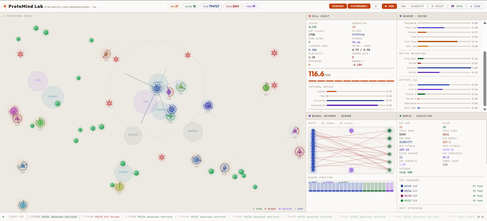
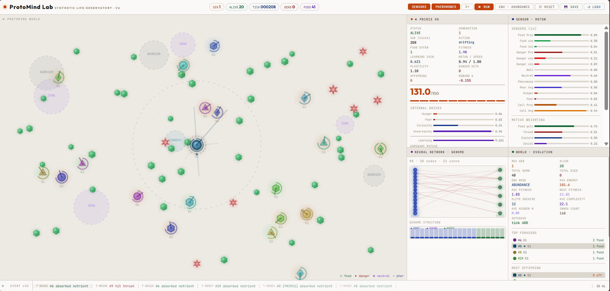

#  ProtoMind Lab

**Synthetic Life Observatory**

ProtoMind Lab is an experimental artificial life and adaptive AI simulation focused on the emergence of behavior in observable digital organisms.

The project explores how simple cell-like agents can sense their environment, act under ecological pressure, adapt through internal learning, reproduce, and pass useful traits across generations. It combines artificial life, neural adaptation, evolutionary dynamics, and interpretable simulation into a single visual environment.

## 🎥 Demo

https://github.com/user-attachments/assets/89c642da-f179-4dad-a116-6b9ddf6874e9

## 🖼️ Preview

## ✨ Features

- artificial life and adaptive AI simulation
- observable digital organisms in a 2D environment
- individual learning during lifetime
- heritable traits across generations
- ecological modes such as scarcity, abundance, and hazard
- adaptive neural/genomic structure
- reproduction, mutation, and evolutionary pressure
- real-time visualization of sensors, internal drives, actions, and evolution statistics
- save/load support for continuing long-running simulations

## ▶️ Run

Open `code/index.html` in a modern browser.

## ⚠️ Status

This repository is an ongoing experimental prototype aimed at studying artificial life, adaptive behavior, heritable adaptation, and interpretable AI-driven evolution in synthetic environments.

## 👨‍💻 Author

**Altan Ulaş Zöhre**
